# Super Cursos - Plataforma de Educação Continuada Gamificada

### Avaliação Continuada 1 (AC1) — Disciplina de DevOps e QA

   **Grupo:** Murilo Araujo, Beatriz, Pedro

---

## O que é este projeto?

Este projeto foi desenvolvido como entrega oficial da **Avaliação Continuada 1 (AC1)** da disciplina de **DevOps e QA**.

Trata-se de uma aplicação completa que simula uma plataforma de **Educação Continuada Gamificada **(denominada **Super Cursos**), onde os alunos acumulam moedas virtuais através de suas atividades e podem convertê-las/trocá-las pela aquisição de novos cursos para expandir seus conhecimentos.

---

## Objetivo

O objetivo principal deste projeto é aplicar e demonstrar na prática conceitos de Engenharia de Qualidade de Software (QA) e Cultura DevOps:

1. **ATDD (Acceptance Test-Driven Development) e BDD (Behavior-Driven Development):** Escrita de histórias de usuário e cenários comportamentais em formato *Gherkin* (*Dado-Quando-Então*) antes de qualquer linha de código.

2. **Ciclo TDD (Test-Driven Development):** Aplicação estrita das três fases do desenvolvimento orientado a testes:
   - 🔴 **RED:** Escrever o teste unitário que define o comportamento esperado e vê-lo falhar.
   - 🟢 **GREEN:** Escrever o código mínimo necessário para fazer o teste passar.
   - 🔵 **BLUE (Refactor):** Refatorar o código, garantindo **100% de cobertura de testes** sem lacunas no JaCoCo.

3. **Arquitetura em Camadas e DDD (Domain-Driven Design):** Isolamento do modelo de domínio puro (`domain.Aluno`) das camadas de persistência (`entity.AlunoEntity`), serviços (`service.AlunoService`), controle (`controller.AlunoController`) e transferência de dados (`dto`).

4. **Documentação e Exposição de API:** Documentação interativa via **Swagger / OpenAPI 3.0**.

5. **Conteinerização com Docker:** Criação de ambiente reproduzível e isolado utilizando `Dockerfile` multi-stage e `docker-compose.yml` integrando a aplicação, banco de dados relacional **PostgreSQL** e interface gráfica **PgAdmin**.

6. **Frontend Integrado:** Interface gráfica interativa e responsiva desenvolvida em **Vue.js + Vite**, permitindo autenticação e troca visual de moedas.

---

## User Stories e BDD

Com base no estudo de caso de Educação Continuada Gamificada, cada integrante do nosso grupo redigiu uma User Story.

O documento completo com essas informações pode ser encontrado em **BDD_Devops_AC1.xlsx**

### Histórias de Usuário Criadas:

| Papel / Integrante            | Como...                                                                          | Quero...                                                | Para...                                                               |                  Status                  |
| :---------------------------- | :------------------------------------------------------------------------------- | :------------------------------------------------------ | :-------------------------------------------------------------------- | :--------------------------------------: |
| **Usuário (Murilo)**   | Como aluno de uma plataforma de venda de cursos                                  | Quero acessar a plataforma de cursos                    | Para poder assistir as aulas                                          |             *Identificada*             |
| **ADM (Beatriz)**       | Como administrador da plataforma de venda de cursos                              | Quero configurar e ajustar as regras de gamificação   | Para que possa adaptar a plataforma de acordo com a regra de negócio |             *Identificada*             |
| **Usuário (Pedro)** 🌟 | **Como aluno com assinatura premium de uma plataforma de venda de cursos** | **Quero converter minhas moedas em novos cursos** | **Para adquirir mais conhecimento**                             | **ESCOLHIDA PARA IMPLEMENTAÇÃO** |

---

### Cenários BDD da US Escolhida (Troca de Moedas por Cursos)

A partir da User Story selecionada (do integrante Pedro), definimos **3 cenários de teste de aceitação (BDD)**, cada um elaborado e assinado por um integrante do grupo (conforme versionado na planilha [`BDD_Devops_AC1.xlsx`](./BDD_Devops_AC1.xlsx)):

#### > Cenário 1 (Murilo) — Saldo Suficiente e Exato (3 Moedas)

> **Dado** que o aluno possui exatamente `3` moedas acumuladas
> **Quando** ele solicitar a troca por um curso cujo custo é de `3` moedas
> **Então** a troca deve ser efetuada com sucesso, o curso deve ser adicionado aos seus cursos adquiridos e seu saldo final deve ser `0` moedas.

#### > Cenário 2 (Beatriz) — Saldo Insuficiente (2 Moedas)

> **Dado** que a aluna possui apenas `2` moedas acumuladas
> **Quando** ela solicitar a troca por um curso cujo custo é de `3` moedas
> **Então** a operação deve ser recusada, nenhum curso deve ser adicionado e seu saldo deve permanecer inalterado em `2` moedas.

#### > Cenário 3 (Pedro) — Saldo Superior ao Custo (5 Moedas)

> **Dado** que o aluno possui `5` moedas acumuladas
> **Quando** ele solicitar a troca por um curso cujo custo é de `3` moedas
> **Então** a troca deve ser efetuada com sucesso, o curso deve ser adicionado aos seus cursos adquiridos e seu saldo restante deve ser de `2` moedas.

---

## Tecnologias Utilizadas

* **Backend:** Java 21, Spring Boot, Spring Data JPA, Spring Security, Hibernate.
* **Qualidade e Testes:** JUnit 5, JaCoCo.
* **Documentação de API:** SpringDoc OpenAPI / Swagger UI.
* **Bancos de Dados:** H2 Database (Banco em memória para testes) e PostgreSQL 16 (Banco persistente de produção).
* **DevOps & Containers:** Docker, Dockerfile, Docker Compose.
* **Frontend:** Vue.js 3, Vite, CSS.

---

## Como Rodar a Aplicação

### Links Rápidos dos Serviços

| Serviço                                       | URL Local                                                                                 | Credenciais / Configuração                                            |
| :--------------------------------------------- | :---------------------------------------------------------------------------------------- | :---------------------------------------------------------------------- |
| **Frontend (Super Cursos)**              | [http://localhost:5173](http://localhost:5173)                                             | Usuário cadastrado no sistema                                          |
| **Swagger UI (Documentação & Testes)** | [http://localhost:8080/swagger-ui/index.html](http://localhost:8080/swagger-ui/index.html) | Acesso livre                                                            |
| **Console H2 (Banco em Memória)**       | [http://localhost:8080/h2-console](http://localhost:8080/h2-console)                       | JDBC URL:`jdbc:h2:mem:devopsdb` \| User: `sa` \| Senha: *(vazia)* |
| **API REST de Alunos**                   | [http://localhost:8080/api/alunos](http://localhost:8080/api/alunos)                       | Retorna JSON de alunos                                                  |
| **PgAdmin 4 (Gestor do PostgreSQL)**     | [http://localhost:5050](http://localhost:5050)                                             | Email:`admin@admin.com` \| Senha: `admin`                           |

---

### Opção A: Execução Local (Spring Boot + Vue.js)

1. **Executar os Testes Automatizados e Gerar Relatório JaCoCo:**

   ```powershell
   .\mvnw.cmd clean test
   ```

   *(O relatório de cobertura estará disponível em `target/site/jacoco/index.html`)*
2. **Iniciar o Backend:**

   ```powershell
   .\mvnw.cmd spring-boot:run
   ```
3. **Iniciar o Frontend (em outro terminal):**

   ```powershell
   cd frontend
   npm run dev
   ```

---

### Opção B: Execução via Docker Compose (Ambiente Integrado)

Para subir todo o ecossistema (PostgreSQL + PgAdmin + Backend Spring Boot):

```powershell
docker compose up --build -d
```

Para verificar o status dos containers:

```powershell
docker compose ps
```

Para desligar o ambiente:

```powershell
docker compose down
```

---

## Evidências do Projeto (TDD, QA, Bancos e Docker)

Nesta seção, apresentamos todas as evidências visuais coletadas durante as etapas de desenvolvimento do projeto:

---

### 🔴 Etapa RED do TDD

Na fase RED, criamos primeiro a classe de testes [`AlunoTest.java`](./src/test/java/com/example/grupo34_atdd/domain/AlunoTest.java) com os 3 cenários de BDD. Como a regra de negócio na classe de domínio ainda não havia sido implementada, os 3 testes falharam propositalmente:

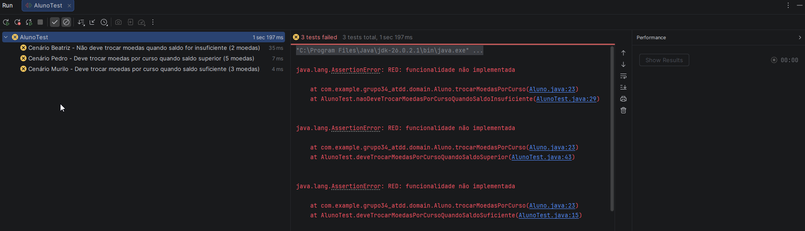
*Figura 1: Execução dos testes no JUnit demonstrando a falha dos 3 cenários (Cenário Beatriz, Pedro e Murilo).*

---

### 🟢 Etapa GREEN do TDD

Na fase GREEN, implementamos a lógica inicial na classe [`Aluno.java`](./src/main/java/com/example/grupo34_atdd/domain/Aluno.java) para atender estritamente aos requisitos dos testes.

#### 1. Testes Passando no JUnit:

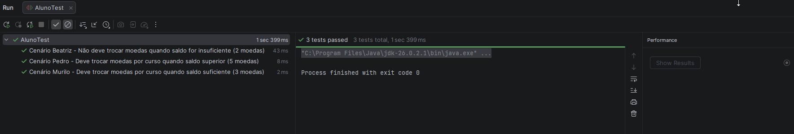
*Figura 2: Os 3 testes do domínio executando com sucesso (barra verde).*

#### 2. Execução Limpa no Maven:

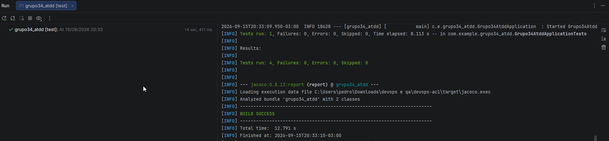
*Figura 3: Execução do comando `mvn test` com resultado `BUILD SUCCESS`.*

#### 3. Cobertura Inicial no JaCoCo:

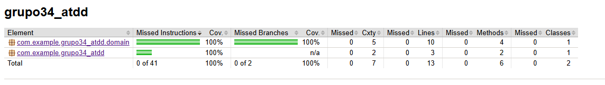
*Figura 4: Relatório JaCoCo comprovando a cobertura de 100% da classe de domínio inicial.*

---

### 🔵 Etapa BLUE do TDD (Refatoração e Design Limpo)

Na fase BLUE, realizamos a refatoração do código:

* Isolamos o modelo puro de domínio [`domain.Aluno`](./src/main/java/com/example/grupo34_atdd/domain/Aluno.java) das entidades JPA de banco de dados [`entity.AlunoEntity`](./src/main/java/com/example/grupo34_atdd/entity/AlunoEntity.java).
* Reduzimos a complexidade ciclomática para apenas **5**, garantindo alta manutenibilidade e baixo acoplamento.

#### 1. Testes JUnit Pós-Refatoração:

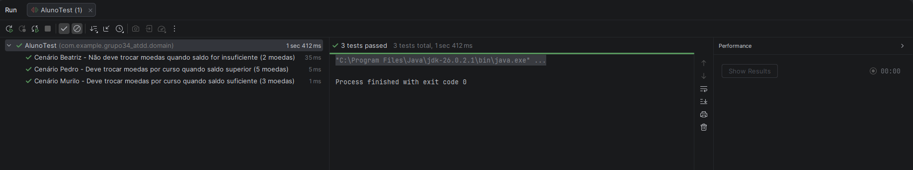
*Figura 5: Testes unitários refatorados passando com 100% de sucesso.*

#### 2. Execução Maven na Etapa BLUE:

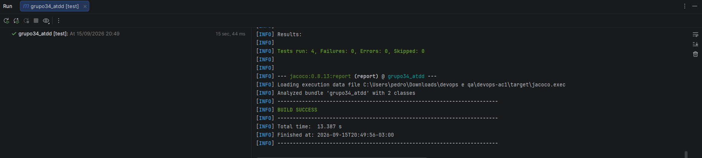
*Figura 6: `mvn test` validando a integridade de todas as suítes de teste.*

#### 3. Cobertura 100% no JaCoCo (Sem Vermelho ou Amarelo):

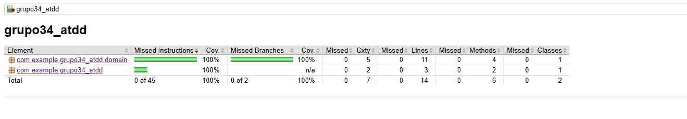
*Figura 7: Cobertura de 100% no pacote de domínio sem linhas amarelas ou vermelhas.*

---

### Cobertura Total em Todas as Camadas da Aplicação

Expandimos os testes unitários com Mockito para abranger **todas as demais camadas** solicitadas no enunciado (Controller, Service, Entity, DTO e Config):

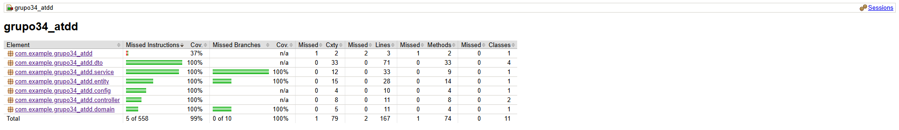
*Figura 8: Relatório do JaCoCo demonstrando **100% de cobertura verde em todos os pacotes do projeto**.*

---

### Evidências dos Bancos de Dados em Execução

#### 1. Banco em Memória H2:

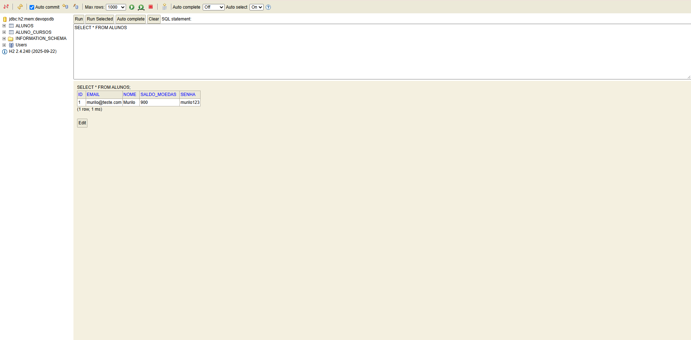
*Figura 9: Console H2 (`jdbc:h2:mem:devopsdb`) com a query `SELECT * FROM ALUNOS;` exibindo os registros persistidos.*

#### 2. Banco PostgreSQL no PgAdmin (via Docker):

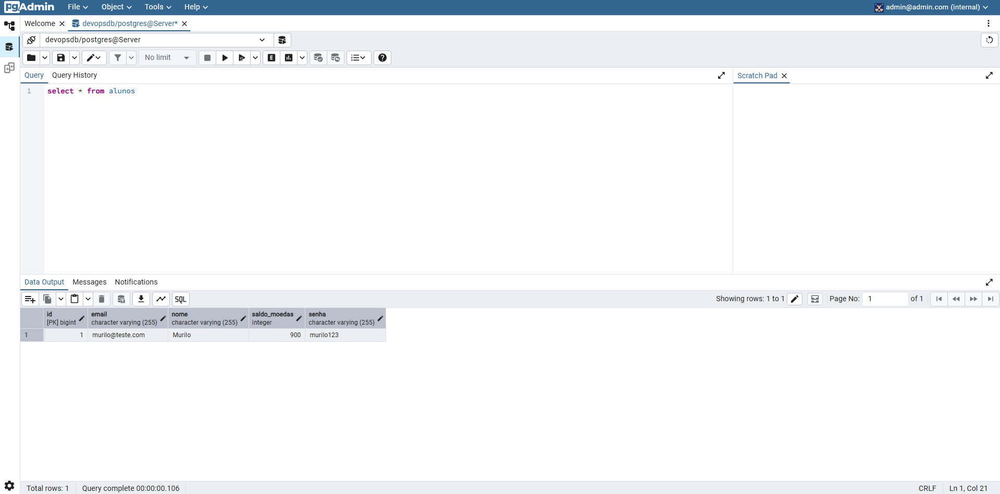
*Figura 10: Interface do PgAdmin 4 conectada ao container `postgres-db` consultando a tabela `alunos` no banco `devopsdb`.*


### Evidências da Execução via Docker e Containers

#### 1. Orquestração e Inicialização com Docker Compose:

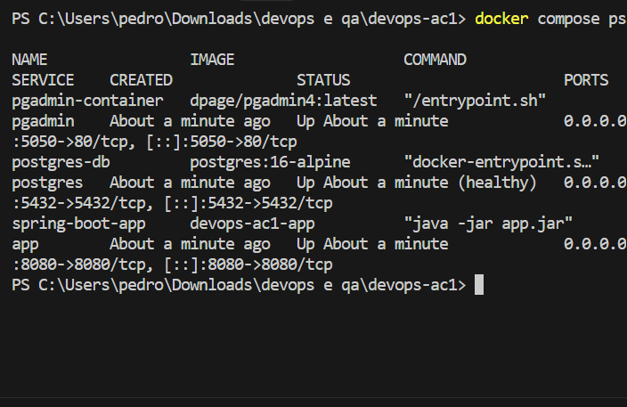
*Figura 11: Execução do `docker compose up --build -d` compilando a imagem e iniciando a rede e os containers.*

#### 2. Containers em Execução (`docker compose ps`):

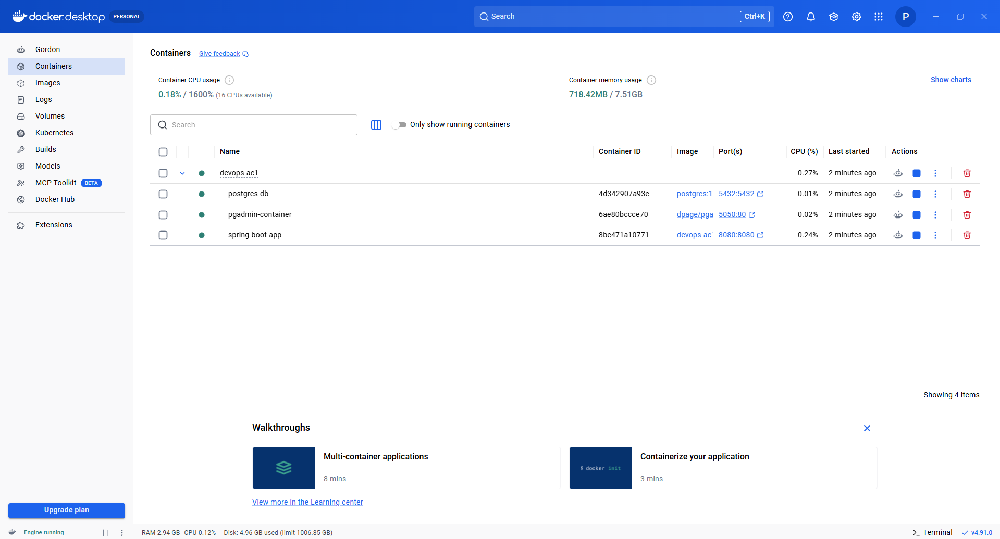
*Figura 12: Terminal exibindo os containers `spring-boot-app`, `postgres-db` (healthy) e `pgadmin-container` ativos e mapeados nas portas 8080, 5432 e 5050.*

---

### Evidências do Swagger e Frontend Vue.js

#### 1. Documentação Interativa da API (Swagger UI):

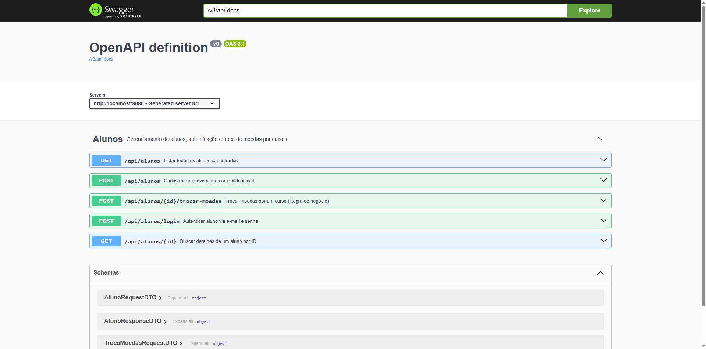
*Figura 13: Interface do Swagger UI expondo todas as operações REST de cadastro, busca, login e troca de moedas.*

#### 2. Tela de Login do Frontend (Vue.js):

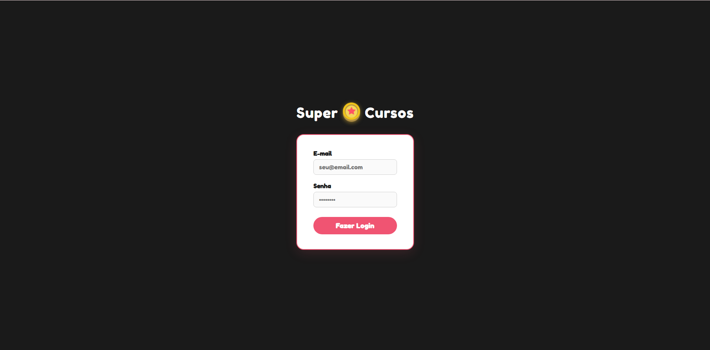
*Figura 14: Tela de Login da aplicação Super Cursos com identidade visual personalizada.*

#### 3. Dashboard e Troca de Moedas no Frontend:

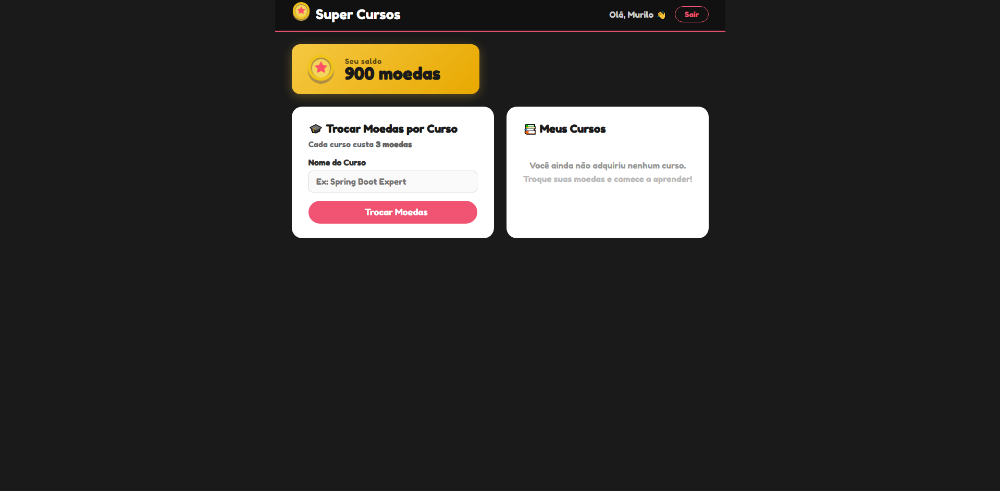
*Figura 15: Painel do aluno autenticado exibindo saldo de moedas, catálogo de cursos e cursos adquiridos após a troca.*


## Identificação do Grupo

* **Murilo Araujo**
* **Beatriz**  **Silva**
* **Pedro** **Augusto**
